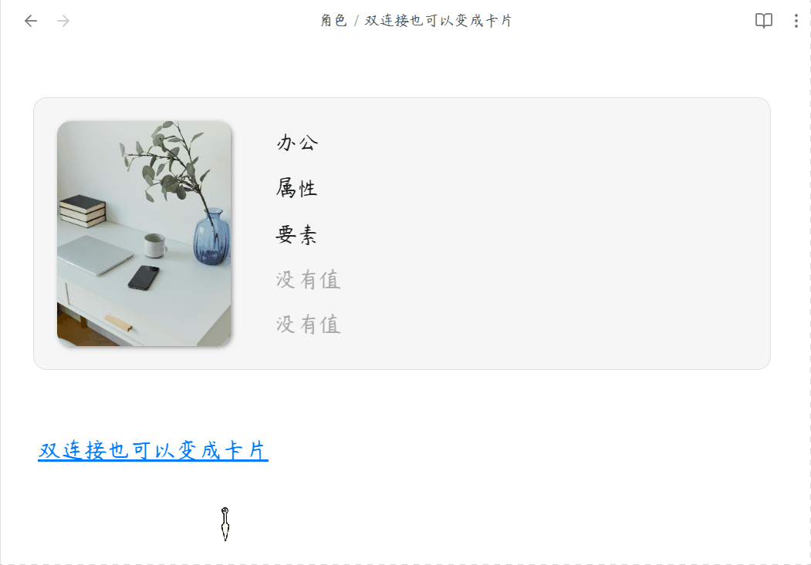

# ✦ Novel Profile (小说角色卡片) ✦

<a href="https://www.xiaohongshu.com/user/profile/6353523d000000001802f8ae?xsec_token=YB4vLkLfzOijtg8c1Vh12ZASaI1ByqPPYi82ZzKbG72qE=&xsec_source=app_share&xhsshare=QQ&appuid=6353523d000000001802f8ae&apptime=1780631605&share_id=3846902afcd94e2ab78467cd7b9b5669" target="_blank"></a>

我在小红书发布了许多obsidian的教程和插件开发进度，你的关注就是对我最大的支持

将原生属性区域转化为精美的角色卡片，专为小说创作者和世界观构建者打造。

<p align="center">
  
</p>

<p align="center">
  
</p>

[简体中文](#简体中文) | [用法](#用法) | [English](#english) | [Usage](#usage)

---

## 简体中文

### 核心功能

#### 1. 自适应卡片排版
左图右文等高拉伸，图片智能居中不变形，支持双链接和网络图片。

#### 2. 防误触沉浸锁定
默认锁定防篡改，保留双链接跳转，快捷键秒切编辑状态。

#### 3. 高度自定义视觉
隐藏属性名称、添加按钮，屏蔽指定属性，打造纯净卡片。

#### 4. 精准生效范围
仅在指定文件夹内生效，不干扰其他笔记的原生样式。

#### 5. 事件时间线系统
二级标题作为事件，三级标题作为版本分支，支持版本切换和事件排序。

#### 6. 悬浮角色预览
鼠标悬停在角色链接上时，弹出精美角色名片预览。

***

## 用法

1. 安装插件后，前往设置填写目标文件夹和图片属性名称。
2. 在目标笔记中添加属性，图片属性填入 `[[头像.jpg]]`，页面自动变身卡片。
3. 按 `Ctrl/Cmd + P` 呼出命令面板，输入"切换属性修改"解锁编辑。
4. 使用二级标题 `##` 创建事件，三级标题 `###` 创建版本分支。

### 事件格式示例

```markdown
## 事件名称

- **时间**：10 年前
- **人物**：[[角色名]]
- **起因**：事件起因描述
- **结果**：事件结果描述
```

***

### 赞赏支持

<details>
<summary>🎁 如果觉得有用，请作者喝杯咖啡</summary>

<br>

<p align="center">
  
</p>

</details>

***

### 安装方法

#### 方法一：社区插件安装（推荐）

待插件通过审核并上架社区市场后：
1. 打开 Obsidian **设置** > **社区插件** > **浏览**。
2. 搜索并选择 `Novel Profile`。
3. 点击 **安装** 并选择 **启用**。

#### 方法二：手动安装

1. 前往 [Releases](https://github.com/hornatx/novel-profile/releases) 页面下载最新的 `main.js`、`manifest.json` 和 `styles.css` 文件。
2. 打开您的 Obsidian 库所在的本地文件夹。
3. 进入 `.obsidian/plugins/` 目录，并创建一个名为 `novel-profile` 的文件夹。
4. 将下载的三个文件放入该文件夹中。
5. 在 Obsidian **设置** > **社区插件** 中重新加载并开启该插件。

***

QQ 交流群：1094620986

---

## English

**Novel Profile** — A beautifully designed Obsidian plugin for novelists, TRPG players, and world-builders. It transforms the native Properties area into an elegant "Left-Image, Right-Text" character profile card with **immersive read-only lock, adaptive layout, and event timeline system**.

***

### Features

#### 1. Adaptive Card Layout
Equal-height flex stretching, smart image cropping with object-fit: cover, supports wikilinks and external images.

#### 2. Anti-Mistouch Immersive Lock
Default read-only mode blocks accidental edits, preserves wikilink navigation, quick toggle via command palette.

#### 3. High Customizability
Hide property keys, remove add button, blacklist specific properties for a clean UI.

#### 4. Targeted Folders
Scoped rendering only applies to configured folders, leaving other notes untouched.

#### 5. Event Timeline System
H2 headings as events, H3 headings as version branches, supports version switching and event reordering.

#### 6. Hover Card Preview
Mouse hover on character links shows a beautiful character card popover.

***

## Usage

1. After installation, go to settings to configure target folders and image property name.
2. Add properties to target notes, set image property to `[[avatar.jpg]]`, the page transforms into a card.
3. Press `Ctrl/Cmd + P` to open command palette, search "Toggle Novel Profile Edit" to unlock editing.
4. Use `##` headings to create events, `###` headings to create version branches.

### Event Format Example

```markdown
## Event Name

- **Time**: 10 years ago
- **Character**: [[Character Name]]
- **Cause**: Event cause description
- **Result**: Event result description
```

***

### Installation

#### Method 1: Community Plugins (Recommended)

Once the plugin is reviewed and listed on the community marketplace:
1. Open Obsidian **Settings** > **Community plugins** > **Browse**.
2. Search for and select `Novel Profile`.
3. Click **Install** and then **Enable**.

#### Method 2: Manual Installation

1. Go to the [Releases](https://github.com/hornatx/novel-profile/releases) page to download the latest `main.js`, `manifest.json` and `styles.css` files.
2. Open your Obsidian vault folder on your computer.
3. Navigate to the `.obsidian/plugins/` directory and create a folder named `novel-profile`.
4. Place the downloaded files into this folder.
5. Reload and enable the plugin in Obsidian **Settings** > **Community plugins**.

***

QQ Group: 1094620986